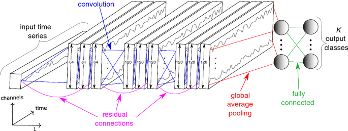

<!-- Improved compatibility of back to top link: See: https://github.com/othneildrew/Best-README-Template/pull/73 -->
<a name="readme-top"></a>
<!--
*** Thanks for checking out the Best-README-Template. If you have a suggestion
*** that would make this better, please fork the repo and create a pull request
*** or simply open an issue with the tag "enhancement".
*** Don't forget to give the project a star!
*** Thanks again! Now go create something AMAZING! :D
-->


<!-- PROJECT SHIELDS -->
<!--
*** I'm using markdown "reference style" links for readability.
*** Reference links are enclosed in brackets [ ] instead of parentheses ( ).
*** See the bottom of this document for the declaration of the reference variables
*** for contributors-url, forks-url, etc. This is an optional, concise syntax you may use.
*** https://www.markdownguide.org/basic-syntax/#reference-style-links
-->


<!-- PROJECT LOGO -->
<br />
<div align="center">
  <a href="https://github.com/DorianJoubaud/ImbalancedTimeSeriesClassification">
    
  </a>

<h3 align="center">Imbalanced Time Series Classification</h3>

  <p align="center">
  Data augmentation aims to create synthetic data from real data, and is widely used in machine learning, especially for classification tasks. In fact, recent deep learning algorithms largely surpass what was done in the past. However, these results rely on a large amount of training data and are very sensitive to imbalanced data, which can lead to overfitting. </br>
  It is often impossible to create balanced datasets from real data. Indeed, we find this problematic in applications such as medical diagnosis with prediction of rare but important diseases or failure detection in manufacturing.
Different data augmentation techniques are proposed in the literature, which can be categorized in two categories: (i) basic data augmentation techniques such as Random Oversampling or SMOTE; and (ii) advanced data augmentation techniques such as generative models or others learning methods.</br>
Although advanced data augmentation techniques are increasingly studied, basic data augmentation techniques remain largely used due to their ease of use as well as their speed. To the best of our knowledge, no research studies has ever analyzed to what extent a given technique is efficient in order to balance datasets depending on the initial datasets imbalancement.</br>
This paper proposes to carry out such an analysis with with well-known techniques for Imbalanced Time Series Classification (ITSC): Random Oversampling, Jittering, Time Warping, SMOTE and ADASYN.
    <br />
    <a href="https://github.com/DorianJoubaud/ImbalancedTimeSeriesClassification"><strong>Explore the docs »</strong></a>
    <br />
    <a href="https://github.com/DorianJoubaud/ImbalancedTimeSeriesClassification/issues">Report Bug</a>


  </p>
</div>


### Installation


 Clone the repo
   ```sh
   git clone https://github.com/DorianJoubaud/ImbalancedTimeSeriesClassification.git
   ```


<p align="right">(<a href="#readme-top">back to top</a>)</p>


<!-- USAGE EXAMPLES -->
## Usage

Use this space to show useful examples of how a project can be used. Additional screenshots, code examples and demos work well in this space. You may also link to more resources.

_For more examples, please refer to the [Documentation](https://example.com)_

<p align="right">(<a href="#readme-top">back to top</a>)</p>


<!-- CONTACT -->
## Contact

Dorian Joubaud - djoubaud@gmail.com


<p align="right">(<a href="#readme-top">back to top</a>)</p>


